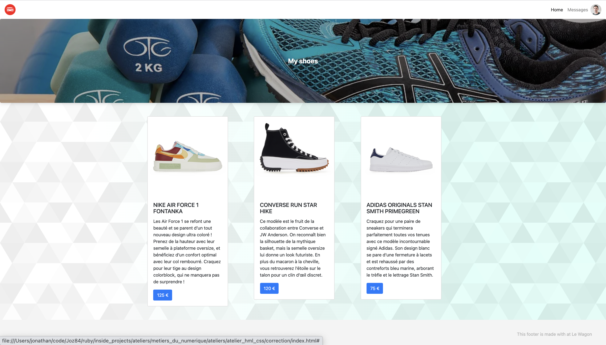
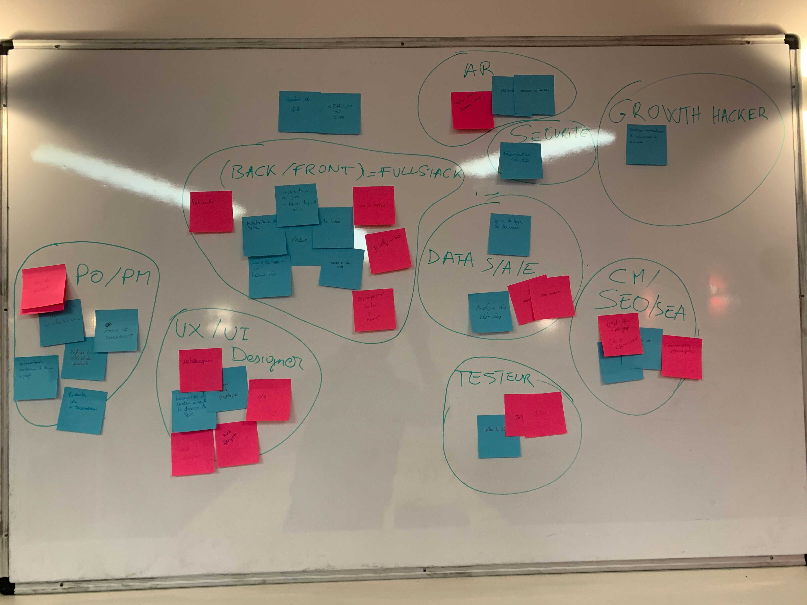

# Atelier Métiers du numérique

### Résumé de l'atelier
L’atelier se divise en deux parties:

#### 1ère partie:
##### Les objectifs :
Cette partie à pour objectif de (re)préciser et clarifier les définitions des différents métiers présents dans le numérique. De manière plus précise cela consiste à :
- Construire ensemble une liste des grands domaines d’activité présents dans le numérique.
- Présenter les principaux métiers présents dans ces différents domaines et plus particulièrement les compétences nécessaires et les actions principales pour chacun d’entre eux. 
- Les interactions entres les différents domaines.

##### Déroulé: 
Cette partie est un atelier participatif ou l’ensemble des participants co-construisent une fresque des différents domaines du numérique. Au cours de la construction une discussion est ouverte sur chacun des métiers/domaines abordés. 

#### 2ème partie:
##### Les objectifs :
La 2ème partie consiste à illustrer succinctement le quotidien de 10 métiers représentatifs des grands domaines d’activité du numérique. De plus, il permet d’illustrer l’interaction et l’interdépendance de ces différents métiers.

##### Déroulé :
Le groupe se positionne comme une agence Web/Data qui a pour mission de concevoir, construire et faire grandir un site de e-commerce. Cette mise en situation oblige le groupe à réfléchir aux différents acteurs, les actions et compétences nécessaires à cette mission. Chaque sous-atelier permet de voir un outil phare utilisé au quotidien par chacun de ces acteurs nécessaires.

#### Liste non exhaustive des domaines/métiers communément abordés :
- Product Owner/Manager
- Design
- Référencement
- Communication/Community manager
- Web Back/Front
- Testing
- Sécurité
- Développement opérationnel
- Administration réseaux
- Big Data/ IA Data Scientist/Analyste 
- Growth Hacking
- …

#### Documents rendus en fin d’atelier:
Photo de la fresque réalisée au cours de la 1ere partie.
Liste des différents métiers avec les compétences et les actions menés par chacun d’eux.
URL du site web créé par le groupe pendant la seconde partie
Liste des outils visuels open source utilisés au cours de l’atelier (palette de couleur, base de données d’images/logos…)

### Liste des différents métiers abordés au cours de cet atelier:
https://www.notion.so/Career-Paths-3af65d4fd523477898aabceb00a326a4

### Ressources visuelles

#### Les générateurs de palette de couleurs
- https://paletton.com/
- https://colorhunt.co/
- https://coolors.co/
- https://www.colourlovers.com/
- https://www.colorzilla.com/
- https://graphiste.com/blog/choisir-palette-couleurs

#### Les ressources d'images
- http://labs.tineye.com/
- https://www.pexels.com/
- https://pixabay.com/fr/

#### Les ressources d'icons et de logos
- https://thenounproject.com/
- https://fontawesome.com/
- https://fr.freelogodesign.org/

#### Les ressources d'illustrations:
- https://undraw.co/
- https://blush.design/collections/open-peeps/open-peeps

## Mise en situation:
L’animateur prend le rôle d’un porteur de projet qui souhaite créer un site de e-commerce de chaussures. Le groupe représente l’agence web qui va devoir l’accompagner pour créer ce e-commerce et lui proposer une stratégie qui devrait lui permettre de croitre. Pour ce faire elle devra identifier les différents métiers nécessaires et concevoir la stratégie à mettre en place.

La séance est composée de deux ateliers principaux:

## La 1er atelier : La diversité des métiers du numérique
### Objectifs: 
- Permettre aux différents participants de réaliser qu’ils connaissent déjà beaucoup de métiers. 
- Préciser le rôle de chacun de ces métiers et leur inter-complémentarité.
- Ouvrir la discussion sur ce sujet.

### Résultats attendus:
- Une mosaïque des différents métiers

### Déroulé: 
- Après s’être présenter, demander à chaque participants de ce présenter
- Présenter la mise en situation ci-dessus
- Présenter l’objectif de l’atelier et son déroulé
- Distribuer à chacun des participants 3 post-it d’une couleur (disons rose) et 3 post-It d’une autre couleur (disons bleue)
- Demander à chacun des participants d’identifier 3 actions (ayant un rapport avec le numérique) que l’agence devra accomplir pour réussir sa mission (exemple : Demander au client les photos des chaussures qu’il souhaite vendre) et les écrire sur un des post-it roses.
- Demander à chacun des participants d’identifier 3 métiers ayant un rapport avec le numérique, même si ceux-ci ne se rappellent pas ou ne connaissent pas exactement la définition.
- Récupérer les post-it de manière anonyme dans un chapeau.
- Dépouiller d’abord les post-it roses. Chaque post-It est collé au tableau et fait l’object d’une clarification par l’animateur, pour être sur que le groupe soit d’accord sur la fonction écrite.
- Regrouper les post-it par domaine d’activité. Par exemple: regrouper tous les post-it ayant attrait au Web design ensemble.
- Dépouiller les métiers sur les post-it bleus avec le groupe. Le groupe doit faire le choix de où positionner le métier par rapport aux domaines d’activité identifiés. Profiter de ce dépouillement pour ouvrir la discussion sur les différents métiers du domaine. Par exemple la différence enter UI et UX designer. 
- Ecrire au fur et à mesure les domaines d’activité sur le tableau
S’assurer que tous les domaines d’activité soient cités. Si ce n’est pas le cas les rajouter
- Présenter succintement la répartition des différents dommaines d'activité dans le bassin d'emploi. (source: https://www.opiiec.fr/secteur/19) 
- Répondre aux questions supplémentaires

## 2ème atelier: Illustrer ces différents métiers
### Objectifs pédagogiques: 
Permettre au participants d’avoir une idée concrète des actions accomplies par les différents acteurs impliqués dans la création et la croissance d’un produit tech.

### Résultats attendus:
- Un site web en ligne présentant 3 chaussures à la vente.
- Une étude prévisionnelles de la croissance du trafic.
- Une identification fine de potentiels partenaires clé.

### Déroulé:
L’atelier se déroule en plusieurs démonstrations toujours collaboratives avec les participants. Certains ateliers sont volontairement moins vulgarisés (notamment ceux faisant intervenir du code) car l’objectif n’est pas de former au code mais de faire prendre conscience du quotidien des métiers. Cette spécificité de l’atelier devra être amenée plusieurs fois et clairement expliquée. 

- 1ere démo: PM/PO
Identifier et hiérarchiser les actions à mettre en place et attribuer chacune de ses actions au métier approprié. (https://github.com/Joz84/test_num_job/projects/1)

- 2eme démo: UX design
Faire le site map et le wireframe de la page principale

- 3eme démo: Gestion de DB
Concevoir la base de données sur un tableau puis la visualiser dans DBviewer, l’extraire au format CSV et l’héberger sur Github

- 4eme démo: UI design
Définir la charte graphique (donner un maximum de ressources), choisir une photo de bannière, générer un logo. Intégrer ces éléments dans un Figma ayant déjà une navbar et un footer.
5eme démo: Front end developper

- Utiliser un template html/CSS avec la navbar et le footer. Inclure la bannière et les cards des chaussureshttps://uikit.lewagon.com/documentation#banner
https://getbootstrap.com/docs/4.6/components/card/

- 6eme démo: Back end developper
Utiliser un fichier JS et y ajouter l’url de la DB (au format CSV sur github) et le bout de code permettant de personnaliser la card avec les infos prises en DB. 

- 7eme démo: Dev Ops
Mettre le site en production sur Github pages et ajouter une chaussure (https://www.courir.com/)Remarque : A chaque fin de démo réactualiser le Kan Ban 

- 8eme démo: Data Scientist
Mise en situation: Le site est maintenant en place depuis quelques mois, sans modification notable.
Récupérer le nombre de visites sur le site sur les 10 derniers mois. Inclure ces résultats sur le site suivant: https://fr.planetcalc.com/5992/
En déduire que la fonction qui fit le mieux avec les observation (la fonction hyperbolique).
Copier la fonction dans le site suivant: https://www.wolframalpha.com/
En déduire que la courbe tend vers une limite et donner la valeur de celle-ci. 
Conclusion: Si aucune action marketing n’est menée sur le site, le nombre de visites sur le site augmentera très peu jusqu’à devenir constant.

- 9eme démo: Growth Hacking
Identification de partenaires clé: 
Aller sur https://phantombuster.com/ pour lancer une LinkedIn Search Export avec les mots clé suivants: « running » et « Bordeaux » et extraire au format CSV le résultat. Prendre des noms et tenter de reconstruire un un email de la forme suivant "prénom.nom@gmail.com" et copier le résultat dans https://dashboard.clearbit.com/lookup jusqu’a trouver un résultat concluant. Cela validera email.
Expliquer que cette démarche peut être automatisée présenter mailchimp.com

